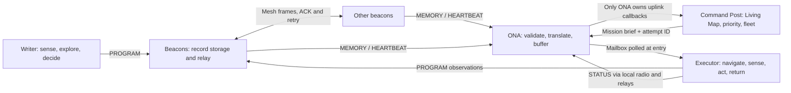
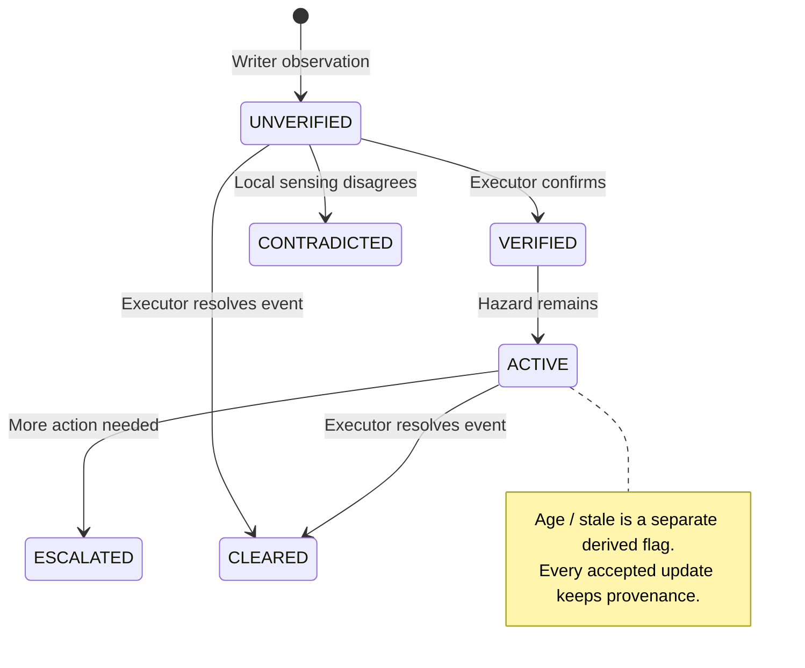

# Living Map: current Phase 1 architecture

All radio, sensor, actuator and distant-uplink behavior here is **SIMULATED**. The algorithms are implemented; hardware validation remains pending.

## System and data boundaries

Robots have a `RobotLink`, never a Command Post transport. The ONA translates coordinates and carries briefs; it does not plan. `tests/test_architecture.py` enforces these boundaries. The simulator owns world truth; each robot owns its discovered map; the Command Post owns only information received through the ONA.

The Writer selects frontiers, integrates local odometry, senses FIRE/GAS and chooses event/relay placement using severity, confidence, redundancy, connectivity and stock. Its exploration budget initiates a return; a separately configured failure stops it away from entry. The Executor receives targets, beacon waypoints, remembered hazards and a blockage policy. Radio edges are relay links, not guaranteed traversable robot paths: navigation still senses and replans.

## Data model and update ownership

For a plain-language field list, storage locations, update flow and inspection instructions, see [What is beacon data?](../communication/beacon-protocol.md#what-is-beacon-data). A beacon stores `(BeaconMessage, MemoryExt)` pairs; the outside Living Map adds GPS, derived freshness and record history. These are different representations of the same finding.

- Physical beacon ID identifies a host. A 16-bit memory ID identifies an observation stream; one beacon can hold multiple records.
- The Living Map merges reports of the same event within the existing 0.3 m radius. Alternate IDs remain addressable through aliases. Per-report versions reject repeated copies; observation timestamps reject older observations. A resolved state outranks UNVERIFIED at equal timestamps.
- `MemoryRecord.version` is the canonical aggregate revision; packet history retains incoming IDs and wire versions. Corroborations count distinct alternate report IDs, not proven independent sensors.
- Age and confidence derive from simulated time since the latest observation. Aging never changes lifecycle. The Executor changes lifecycle by writing a new observation through a beacon.
- Records, queues and mailboxes live in process memory. JSON exports are diagnostic evidence. No restart persistence or database is implemented.

## Mission and recovery sequence

Each dispatch gets a positive process-unique 16-bit attempt ID, including retries and resets. Outcomes update their own assignment; state updates also require the latest assignment and a newer modular sequence number. A late valid result may close its old mission without releasing a newer executor reservation. Duplicate outcomes are ignored. Queue insertion keeps one entry per mission ID. A BLOCKED status may name a different memory (the blockage); its attempt identifies the affected target mission.

Legacy zero-attempt briefs/statuses remain supported for legacy assignments. They cannot update modern assignments. IDs/versions must fit their wire ranges; exhaustion raises an explicit error rather than wrapping silently.

## Inspection and implementation boundaries

`simulation/jury_demo.py` supplies one milestone controller to headless acceptance and the existing Pygame renderer. Milestones use live records, assignments, observations and return states. Transport keeps stepping until completion checks stabilize. Mission/Memory views are read-only diagnostics; received packet bytes come from a bounded delivery trace.

Phase 2 work remains physical robots, calibrated sensors and odometry, a beacon drop mechanism, real RF and distant transport, and field measurements. See `hardware/README.md` for the existing hardware plan. Firmware, calibration, range and GPS accuracy are not established by these simulations.
