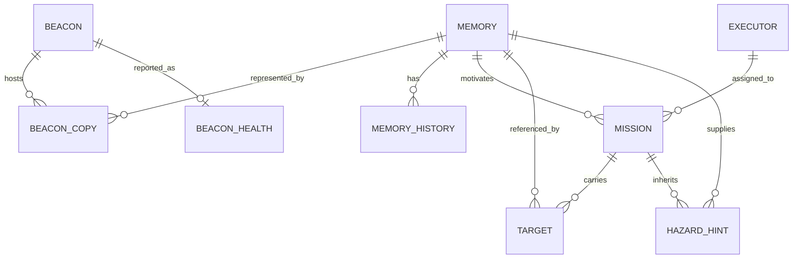

# Living Map data model and storage discovery

Review date: 5 October 2026. Source revision: `a7db087`. This is a continuation of the project review, focused on how information is represented, stored, linked, updated, and consumed.

## 1. What the project's database consists of

The delivered source contains no SQL database, database server, ORM, migration files, or database connection configuration. No application SQLite database, SQL dump, or separate source dataset was found in the checkout. The JSON files under `audit/` are review outputs, not an application database.

The current data layer is distributed across Python objects in one running simulation:

| Owner | Storage | Key | What it holds |
|---|---|---|---|
| Simulator | `GroundTruthWorld` | Cells and hidden-event IDs | Actual arena, hazards, resolved events, debris, change log |
| Each robot | `DiscoveredWorld._cells` | `(row, col)` | Locally observed FREE/WALL/BLOCKED states; absent cells are UNKNOWN |
| Each robot | `passage_info`, `hint_free`, `observations` | Cells / lists | Passage beliefs, inherited free-space hints, and observations |
| Each beacon | `BeaconNode.records` | Logical memory ID | `(BeaconMessage, MemoryExt)` pairs |
| ONA | `recent`, `seen_count`, `beacon_table` | Memory or beacon IDs | Received observations and beacon telemetry for forwarding/display |
| ONA | `_buffer`, `_uplink_buffer` | Queue position | Messages waiting for downstream acceptance |
| ONA | `_mailbox` | Executor ID | One pending mission brief per Executor |
| Command Post | `LivingMap._records` | Logical memory ID | Consolidated current records, with local history and derived confidence |
| Command Post | `LivingMap.beacons` | Physical beacon ID | Latest beacon health and routing information |
| Command Post | Dispatcher queue, active slots, history | Mission ID / Executor ID | Mission lifecycle and assignments |
| Command Post | `FleetRegistry._fleet` | Executor ID | Capabilities, state, battery, reservation, and mission counts |
| Command Post | `waiting_on` | Blockage memory ID | Mission IDs waiting for that obstruction to clear |
| Simulator | `MetricsRecorder.runs` | List position | Writer run metrics |

These are related in-memory stores. Python does not enforce database-style foreign keys, transactions, uniqueness constraints, or durable commits for them.

Source anchors: `simulation/world.py`, `beacon/node.py`, `gateway/ona_gateway.py`, `command_post/map_state.py`, `command_post/mission_dispatcher.py`, and `command_post/fleet.py`.

## 2. Entities and relationships

This is a conceptual relationship diagram, not a deployed relational schema. In particular, beacon copies and histories are embedded objects, and a mission's previous assignments are not preserved as a complete normalized attempt table.

### Observation

`common/models.py::Observation` represents a detection candidate: event type, grid row/column, severity, confidence, detection tick, and source. An observation becomes preserved memory only after Writer policy accepts it.

### Physical beacon and its stored copy

A beacon is a node with its own ID, local position, parent, hop count, battery, capacity, and network state. Its stored memory values consist of:

- `BeaconMessage`: host beacon ID, event type, local event coordinates, observation timestamp, severity, confidence, battery, and Python-level version/GPS fields.
- `MemoryExt`: logical memory ID, transmitted version, lifecycle state, passage state, latest update time, and source radio-node ID.

The base 18-byte message omits GPS and version. The active memory payload adds a 10-byte extension; it transmits version and lifecycle state. A complete MEMORY mesh frame is 39 bytes.

### Consolidated memory record

`common/memory.py::MemoryRecord` is the Command Post's current view of an event. Its important fields fall into these groups:

| Group | Fields |
|---|---|
| Identity | `memory_id`, `beacon_id`, `host_beacon_id` |
| Event and location | `event_type`, `x_local`, `y_local`, `gps_lat`, `gps_lon`, `severity`, `passage_state` |
| Observation time | `timestamp`, `last_update_ts`, `received_tick` |
| Confidence | `initial_confidence`, `observed_confidence` |
| Lifecycle and source | `version`, `state`, `source`, `source_node`, `verified_by` |
| Transport/health metadata | `battery_pct`, `hop_count` |
| Local audit metadata | `history`, `corroborations` |

`age_seconds`, `live_confidence`, `confidence_pct`, `is_stale`, `is_open`, and `mission_relevance` are computed from stored values and the injected clock. They are not independent measurements.

The initial timestamp remains the creation timestamp when an existing record receives a newer observation. `last_update_ts` advances and restarts observation aging. Likewise, `initial_confidence` remains the original value while `observed_confidence` tracks the latest observation. A reproduced update from 90% to 10% retained initial confidence 90 and changed observed confidence to 10.

### Beacon health

`BeaconHealth` tracks the latest advertised location, GPS conversion, parent, hops, battery, record count, maximum version, last update, last seen tick, and received hop count. Health updates do not change event lifecycle versions. Event position and beacon position need not be identical.

### Mission and mission brief

`MissionRecord` is the Command Post's scheduling record: mission ID, associated memory, event type, priority, target coordinates, severity, required capability, arrival tick, state, assigned Executor, dispatch tick, and completion tick.

`Mission` is the brief carried through the ONA mailbox: targets, waypoint positions, hazard hints, blockage policy, optional search types, baseline memory/version references, issue tick, and explanation.

The distinction matters: a completed mission may leave its memory ACTIVE or ESCALATED. The mission states what an Executor did; the memory states what is currently believed about the environment.

## 3. Identity conventions and naming traps

There are several distinct IDs:

| ID | Example | Meaning |
|---|---|---|
| Hidden event ID | `1` | Simulator truth/scoring identity |
| Beacon ID | `1` | Physical memory/relay host |
| Memory ID | `257` (`0x0101`) | Logical spatial event identity |
| Radio node ID | `65`, `128` | Writer or Executor endpoint identity |
| Executor ID | `E01` | Command Post fleet label |
| Mission ID | `M001` | Scheduling identity |
| Packet identity | `(origin, seq)` | Transport duplicate identity |

`memory_id_for(prefix, counter)` packs an 8-bit robot prefix and an 8-bit counter into 16 bits. Writer 1's first memory is 257. Packet sequence numbers are separate from logical record versions.

Some historical field names obscure these distinctions:

- `MissionRecord.beacon_id` carries a logical memory ID in the active dispatcher. In the reproduced demo, it is 257 while the physical host is beacon 1.
- `MemoryRecord.beacon_id` is set when the record is first created. Moving the record to another host updates `host_beacon_id`, but leaves this older field unchanged. A probe produced `beacon_id=1`, `host_beacon_id=2` for the same memory.
- Radio-derived source label `E1` can refer to fleet Executor `E01`. The naming comes from two different labeling conventions.

Use `memory_id` to address a logical event and `host_beacon_id` for its current physical host. Avoid treating every field named `beacon_id` as the same kind of reference.

## 4. Lifecycle of a piece of data

1. Simulator sensing supplies local cells and an event observation.
2. The Writer detector/policies decide what merits preservation.
3. The Writer allocates a memory ID, chooses or drops a host, and emits a PROGRAM frame.
4. The beacon stores the record if its version/capacity rules allow it.
5. The beacon originates MEMORY frames and relays them toward the ONA.
6. The ONA validates the frame, suppresses already-seen packet identities, decodes the payload, adds GPS coordinates, and forwards or buffers it.
7. The Living Map compares the logical record version; a newer version updates the current record, while equal/older versions return the existing record.
8. The Command Post updates mission state and priorities, reserves an available Executor, and puts a brief in the ONA mailbox.
9. The Executor consumes that brief at entry, navigates, senses, acts, and writes another record version into an accessible beacon.
10. MEMORY and STATUS frames travel independently back through the network. The former updates environmental knowledge; the latter updates fleet and mission state.

There is no atomic transaction spanning a beacon write, network delivery, mission completion, and Living Map update. The implementation coordinates them through version checks, packet duplicate checks, reservation flags, queues, and periodic processing.

The two duplicate mechanisms serve different purposes: receiving the same packet again is a transport duplicate; receiving a new packet with the same memory/version is a logical duplicate. Spatial merging is a third mechanism, intended to recognize independent reports of the same event.

## 5. Reproduced normal runtime example

A fresh `simulation.global_demo.run(seed=42)` was inspected directly. After the Executor phase:

| Memory | Event | Physical host | Version | Current state | Assigned mission | Mission state |
|---:|---|---:|---:|---|---|---|
| 257 | GAS | 1 | 2 | ACTIVE | M001 / E07 | COMPLETED |
| 258 | FIRE | 2 | 2 | CLEARED | M002 / E01 | COMPLETED |

The beacon stores and consolidated Living Map agreed on these versions/states. This confirms the normal write → relay → update flow in this scenario.

The gas mission completed even though the gas record remained ACTIVE, consistent with the simulator's gas response behavior. The Command Post does not automatically recreate a finished mission for each subsequent open-record retransmission.

Constructing a fresh system from the same scenario produced zero stored Living Map records and zero deployed beacon objects. Running the demo again reconstructs state; it does not reload prior operational memory.

## 6. Retention, capacity, and durability

| Structure | Current limit or behavior |
|---|---|
| Physical beacon IDs | Factory allocates IDs 1 through 63, then refuses more drops |
| Beacon record capacity | Default four records per beacon |
| Full beacon store | Can evict a CLEARED/CONTRADICTED record; rejects a new record when all stored records are open |
| Beacon unsent relay queue | Default 16 frames; oldest queued frame is removed on overflow |
| Beacon packet seen-set | Default 256 identities |
| Robot outbox | Configured limit 16 on the no-uplink branch; failed-send append does not apply the same limit |
| ONA packet seen-set | 512 identities |
| ONA recent-memory display list | Latest 24 memory entries, by arrival |
| Living Map recent update display | Last 40 entries |
| ONA mission mailbox | One brief per Executor; another brief replaces it; polling removes it |
| Command Post main log | Last 400 entries via `_note()` |
| ONA downstream buffers | Lists without a configured maximum in the inspected code |
| Record history, map log, dispatcher history/decisions | No general persistent archival or retention policy |

There are no disk writes or reloads for operational beacon/Command Post state. A robot failure leaves other objects alive, while a new process/system begins empty. The persisted audit JSON contains selected review evidence only.

Timestamps are based on a fixed simulation epoch and 0.1 simulated seconds per tick. They do not establish real clock synchronization across independent embedded devices.

## 7. Confirmed edge cases from isolated probes

These probes instantiate fresh existing objects and exercise current methods. They do not modify application source. Results are saved in `audit/data-discovery.json`, and the reproduction script is `audit/discover_data.py`.

| Probe | Observed result | Implication |
|---|---|---|
| Same alternate memory report merged three times | One canonical record; three corroborations; alternate-ID lookup returns no record | Corroboration does not establish independent sources; alias identity is not retained |
| Alternate merged record later sends CLEARED v2 | Canonical record remains UNVERIFIED; alternate ID remains absent | A valid lifecycle update can be absorbed as corroboration without clearing canonical memory |
| Record changes physical host | Original `beacon_id` stays 1, current `host_beacon_id` becomes 2 | Consumers must use the correct identity field |
| New record when a one-record beacon is full with an open record | Write returns false | Full-store acceptance must be distinguished from radio receipt |
| Same store after its existing record becomes CLEARED | New write succeeds and replaces the closed record | Closed-record eviction policy works in the probe |
| Transmit version 256 after version 255 | Wire version becomes 0; beacon rejects it as older | Ordinary greater-than ordering does not handle version wrap |
| Memory counter 1 versus 257 with the same prefix | Both produce memory ID 257 | ID uniqueness is limited to the counter range |
| Failed assigned mission is re-queued | Queue contains the same mission object twice | Failure recovery can duplicate queue entries and distort counts/scheduling |
| Delayed VERIFIED outcome for a previous mission while a new one is assigned to the same Executor | New mission becomes COMPLETED, despite stale sequence being counted as dropped | Outcome matching/order does not adequately isolate mission attempts |
| Export `Mission.to_dict()` | Omits `policy`, `memory_ref`, `version_ref`, `issued_tick` | Export is a presentation subset, not a complete brief round trip |
| Queue two briefs for the same Executor, then poll twice | Second brief returned; next poll returns none | Mailbox is replace-and-consume, not a durable mission queue |

The delayed-outcome probe is particularly relevant: `CommandPost.on_status()` applies outcomes before stale-state rejection and can fall back from an old memory's finished mission to the Executor's current active mission. The current STATUS payload has no explicit mission/attempt ID to anchor this distinction.

The merged-record probe is also relevant to replacement Writers. `LivingMap.ingest()` locates a nearby same-type open record for an unknown memory ID and returns that canonical record without storing an alias mapping. Repeated frames can therefore repeatedly corroborate it, and later lifecycle updates under the alternate ID do not necessarily update the canonical lifecycle.

These results extend the earlier successful suite/demo evidence. Passing existing tests does not mean these additional cases were covered.

The existing data-related test groups were also rerun with `python -B -X utf8 -m pytest -q --import-mode=importlib -p no:cacheprovider`, covering memory, versioning, lifecycle, gateway, ONA mesh, mission dispatcher, and Command Post: **84 passed in 1.58 seconds**. Their output is in `audit/data-focused-tests.txt`. The isolated probes above are additional evidence outside those existing tests.

## 8. Exports and future database requirements

Current `to_dict()` methods and demo JSON are designed for reporting. `MemoryRecord.to_dict()` includes derived values and history but omits several raw fields needed to reconstruct it exactly, including the original observation timestamp/confidence and source-node metadata. `Mission.to_dict()` also omits mission policy and reference fields. There are no matching operational restore methods.

If durable storage is introduced later, its minimum responsibilities should be derived from the current system:

- Persist run/session identity and calibration: arena/reference frame, reference GPS/heading, clock convention, and software/configuration version.
- Keep stable logical event IDs, current record state, raw observation times/confidences, and explicit source identities.
- Record accepted observations and state changes in a structured history, rather than relying solely on human-readable strings.
- Preserve canonical-ID/alias relationships and make repeated observations idempotent.
- Track physical hosts and versions separately from logical records; handle wrapping counters or use wider monotonic identities.
- Keep mission attempts, assignments, outcomes, and referenced memory versions so delayed reports can be matched to the right attempt.
- Preserve outbox/buffer acknowledgment state when restart recovery is required.
- Support complete serialization/restoration, storage limits, and restart checks.

These are identified requirements, not an implemented database or a selected database technology. Phase one can continue using the current stores while presenting their persistence boundary clearly.

## 9. Resulting understanding and next investigation priorities

The project is a simulation of a distributed knowledge and mission system. Environmental truth, robot beliefs, beacon copies, consolidated knowledge, and mission records are separate layers. The useful memory is primarily an event-and-passage model with confidence and verification state, rather than a complete geometric map.

The normal scenario demonstrates the intended information loop. The remaining consistency work centers on identity reconciliation, update acceptance, mission/outcome correlation, capacity behavior, and restart persistence. Before expanding features, the highest-value fixes are the merged-record update problem, delayed mission outcomes, duplicated failed-mission queue entries, and the ordinary test import collision. The version/ID limits and incomplete exports should be documented and tested against the intended deployment duration.

For the overall phase-one assessment and deliverable plan, see [PROJECT_UNDERSTANDING_PHASE1.md](../PROJECT_UNDERSTANDING_PHASE1.md).
